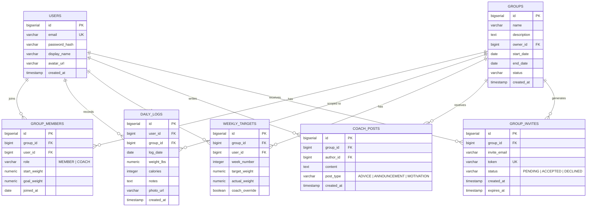
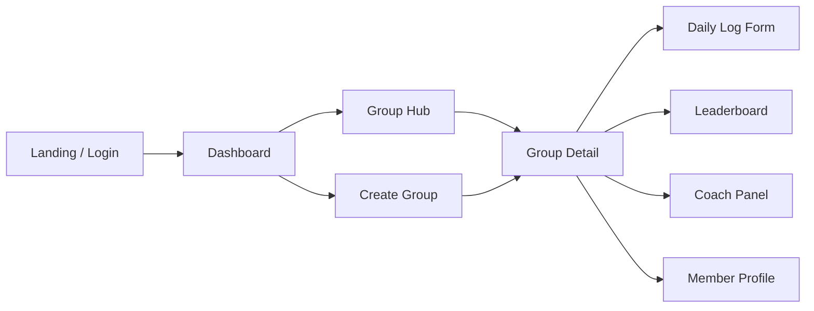

# FitForge — Implementation Plan

A full-stack fitness tracker web app for group-based weight-loss challenges with coach support, leaderboards, and automated weekly goals.

---

## Domain Model

### Key Business Rules

| Rule | Detail |
|---|---|
| **Auto weekly targets** | On group creation or member join, the system calculates `(start_weight − goal_weight) / total_weeks` and generates a `WEEKLY_TARGETS` row per week with linearly interpolated `target_weight`. |
| **Coach override** | A coach can PUT to any user's weekly target to adjust `target_weight` and set `coach_override = true`. |
| **Flexible timeline** | `end_date` is user-defined; the system derives week count from `(end_date − start_date) / 7`. |
| **Multi-group** | A user can belong to many groups simultaneously, each with independent goals. |
| **Leaderboard ranking** | Ranked by `% of goal achieved` = `(start_weight − latest_weight) / (start_weight − goal_weight) × 100`. |

---

## API Endpoints

### Auth
| Method | Path | Description |
|---|---|---|
| POST | `/api/auth/register` | Create account (email, password, displayName) |
| POST | `/api/auth/login` | Returns JWT |
| GET  | `/api/auth/me` | Current user profile |

---

### Users
| Method | Path | Description |
|---|---|---|
| PUT | `/api/users/me` | Update profile (displayName, avatarUrl) |

---

### Groups
| Method | Path | Description |
|---|---|---|
| POST | `/api/groups` | Create group (name, description, startDate, endDate) — creator becomes COACH |
| GET  | `/api/groups` | List my groups |
| GET  | `/api/groups/{id}` | Group detail + member summary |
| PUT  | `/api/groups/{id}` | Update group (coach only) |
| DELETE | `/api/groups/{id}` | Archive group (coach only) |

---

### Group Members
| Method | Path | Description |
|---|---|---|
| POST | `/api/groups/{id}/join` | Join via invite token |
| GET  | `/api/groups/{id}/members` | List members + roles |
| PUT  | `/api/groups/{id}/members/{userId}/role` | Promote/demote (coach only) |
| DELETE | `/api/groups/{id}/members/{userId}` | Remove member (coach) or leave (self) |

---

### Invites
| Method | Path | Description |
|---|---|---|
| POST | `/api/groups/{id}/invites` | Send invite (email or link) |
| GET  | `/api/invites/{token}` | Validate invite |
| POST | `/api/invites/{token}/accept` | Accept invite, set start/goal weight |

---

### Daily Logs
| Method | Path | Description |
|---|---|---|
| POST | `/api/groups/{groupId}/logs` | Log today (weight, calories, notes, photo) |
| GET  | `/api/groups/{groupId}/logs?userId=&from=&to=` | Query logs (filterable) |
| PUT  | `/api/groups/{groupId}/logs/{id}` | Edit a log entry |
| DELETE | `/api/groups/{groupId}/logs/{id}` | Delete a log entry |

---

### Weekly Targets
| Method | Path | Description |
|---|---|---|
| GET  | `/api/groups/{groupId}/targets?userId=` | Get weekly targets for a user |
| PUT  | `/api/groups/{groupId}/targets/{id}` | Coach adjusts a target |

---

### Coach Posts
| Method | Path | Description |
|---|---|---|
| POST | `/api/groups/{groupId}/posts` | Create post (coach only) |
| GET  | `/api/groups/{groupId}/posts` | List posts (paginated) |
| DELETE | `/api/groups/{groupId}/posts/{id}` | Delete post (coach only) |

---

### Leaderboard
| Method | Path | Description |
|---|---|---|
| GET  | `/api/groups/{groupId}/leaderboard` | Ranked members with % progress, current week bar |

---

## UX Flow

### Screen Descriptions

| # | Screen | Key Elements |
|---|---|---|
| 1 | **Landing / Auth** | Hero section with motivational imagery, Login / Register forms with glassmorphism cards |
| 2 | **Dashboard** | Greeting + streak counter, cards for each group (name, current week, mini progress ring), quick-log CTA button |
| 3 | **Create Group** | Stepper form: Name → Timeline (start/end date picker) → Invite members → Review. Real-time preview of how many weeks and weekly target. |
| 4 | **Group Hub** | Tabbed view: **Feed** (coach posts), **Leaderboard**, **My Progress**, **Settings** |
| 5 | **Daily Log** | Slide-up modal or dedicated page — weight input (animated scale graphic), calorie field, photo upload, notes textarea. Success animation on save. |
| 6 | **Leaderboard** | Ranked cards with avatar, name, % progress bar (gradient fill), trend arrow (up/down vs last week). Top 3 get medal badges. |
| 7 | **Coach Panel** | Visible only to COACH role. Post advice (rich text), view member list with per-member target adjuster (slider or inline edit), bulk announce. |
| 8 | **Member Profile** | Weight chart (line graph over time), weekly target vs actual overlayed, photo timeline carousel, streak badges. |

### Design Aesthetic
- **Color palette**: Deep navy `#0f172a` background, electric teal `#06b6d4` primary, amber `#f59e0b` accent, soft whites for text
- **Typography**: Inter (headings) + DM Sans (body) from Google Fonts
- **Effects**: Glassmorphism cards, subtle glow shadows, smooth page transitions, micro-animations on data entry
- **Responsiveness**: Mobile-first, bottom nav on small screens, sidebar on desktop

---

## Proposed Changes

### Backend (`server/`)

#### [NEW] [pom.xml](file:///d:/workspace/FitForge/server/pom.xml)
Maven project with Spring Boot 3, Spring Web, Spring Security, Spring JDBC, PostgreSQL driver, jjwt, Lombok.

#### [NEW] [src/.../FitForgeApplication.java](file:///d:/workspace/FitForge/server/src/main/java/com/fitforge/FitForgeApplication.java)
Spring Boot entry point.

#### [NEW] [src/.../config/SecurityConfig.java](file:///d:/workspace/FitForge/server/src/main/java/com/fitforge/config/SecurityConfig.java)
JWT filter, CORS config, public/protected routes.

#### [NEW] [src/.../config/JwtUtil.java](file:///d:/workspace/FitForge/server/src/main/java/com/fitforge/config/JwtUtil.java)
Token generation and validation.

#### [NEW] [schema.sql](file:///d:/workspace/FitForge/server/src/main/resources/schema.sql)
Full DDL for all 7 tables with constraints, indexes, and seed data.

#### [NEW] [application.properties](file:///d:/workspace/FitForge/server/src/main/resources/application.properties)
Database URL, JWT secret, server port, CORS origins.

#### [NEW] DAO Layer — one DAO per entity
- `UserDao.java` — findByEmail, create, update
- `GroupDao.java` — CRUD, findByUserId
- `GroupMemberDao.java` — join, leave, updateRole, findByGroupId
- `DailyLogDao.java` — CRUD, findByGroupAndUser
- `WeeklyTargetDao.java` — generate, findByGroupAndUser, coachUpdate
- `CoachPostDao.java` — create, findByGroup, delete
- `GroupInviteDao.java` — create, findByToken, accept

#### [NEW] Service Layer — one service per domain area
- `AuthService.java` — register, login, password hashing
- `GroupService.java` — create (auto-generates weekly targets), update, archive
- `MembershipService.java` — join, leave, role management
- `LogService.java` — daily logging, validation
- `TargetService.java` — auto-calculate targets, coach override
- `LeaderboardService.java` — rank members by % progress
- `InviteService.java` — send invite, validate, accept

#### [NEW] Controller Layer — one controller per resource
- `AuthController.java`
- `GroupController.java`
- `MemberController.java`
- `LogController.java`
- `TargetController.java`
- `CoachPostController.java`
- `InviteController.java`
- `LeaderboardController.java`

---

### Frontend (`client/`)

#### [NEW] Vue 3 project via Vite
Initialized with `create-vue` — Vue Router, Pinia store, vanilla CSS.

#### [NEW] Design System (`src/assets/main.css`)
CSS variables, typography, glassmorphism utilities, animation keyframes.

#### [NEW] Auth Views
- `LoginView.vue` — glassmorphism card, email/password, register link
- `RegisterView.vue` — name, email, password, confirm

#### [NEW] Dashboard (`DashboardView.vue`)
- Group cards with progress rings
- Quick-log floating action button
- Motivational streak counter

#### [NEW] Group Views
- `CreateGroupView.vue` — multi-step form with timeline preview
- `GroupDetailView.vue` — tabbed hub (Feed, Leaderboard, Progress, Settings)
- `JoinGroupView.vue` — invite token landing

#### [NEW] Log Views
- `DailyLogModal.vue` — weight, calories, photo, notes
- `ProgressView.vue` — weight chart, weekly targets overlay, photo carousel

#### [NEW] Leaderboard (`LeaderboardView.vue`)
- Ranked member cards, gradient progress bars, medal badges

#### [NEW] Coach Panel (`CoachPanelView.vue`)
- Post advice form, member target adjuster, announcement composer

#### [NEW] Shared Components
- `AppNavbar.vue`, `ProgressBar.vue`, `AvatarBadge.vue`, `WeightChart.vue`, `PhotoCarousel.vue`, `ToastNotification.vue`

---

## Verification Plan

### Automated Tests
1. **Backend compilation**: `cd server && mvn clean compile` — must succeed with 0 errors
2. **Backend tests**: `cd server && mvn test` — unit tests for services (target calculation, leaderboard ranking)
3. **Frontend build**: `cd client && npm run build` — must produce a `dist/` folder with 0 errors

### Browser Smoke Test
1. Open `http://localhost:5173` → Verify login page renders with glassmorphism styling
2. Register a new user → Verify redirect to dashboard
3. Create a group with a custom timeline → Verify weekly targets auto-generated
4. Log daily weight → Verify leaderboard updates
5. Switch to coach role → Verify coach panel is accessible and can adjust targets

### Manual Verification (User)
- Deploy locally with `docker compose up` (Postgres) + `mvn spring-boot:run` + `npm run dev`
- Walk through the full flow: register → create group → invite → log → leaderboard → coach adjust
- Verify mobile responsiveness by resizing browser

> [!IMPORTANT]
> This is a large project. I recommend building it in vertical slices: **Auth → Groups → Logging → Leaderboard → Coach**. Each slice will be end-to-end (DB → API → UI) so you can test incrementally.
